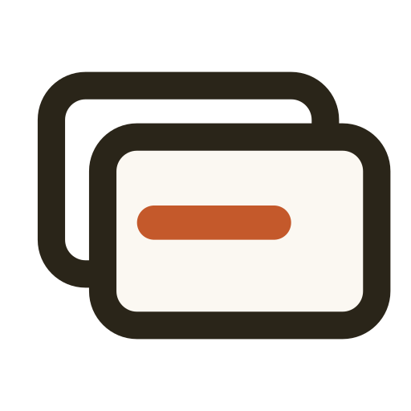
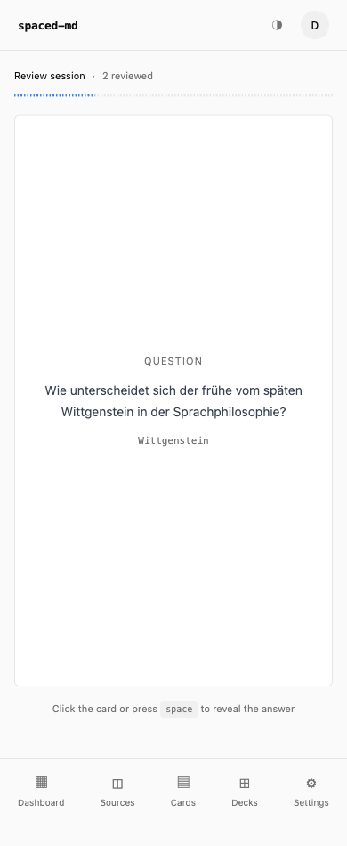
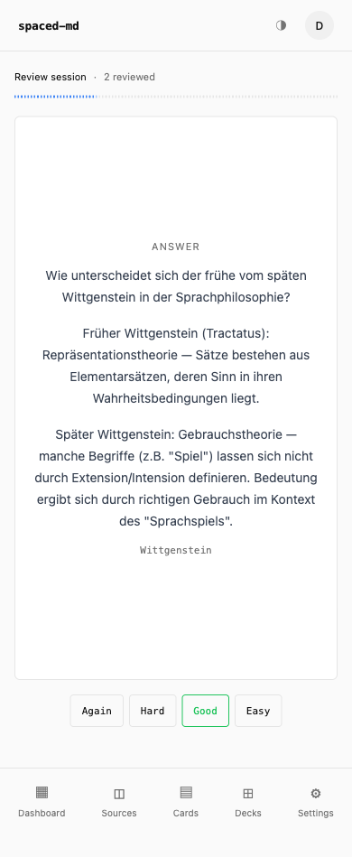
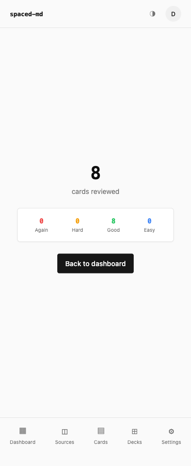

<p align="center">
  
</p>

<h1 align="center">fasolt</h1>

<p align="center">
  MCP-first spaced repetition for your markdown notes.<br/>
  Your AI reads your notes — you learn and remember.
</p>

---

Connect fasolt to Claude Code, Cursor, or any MCP-compatible agent. Point it at your markdown files. Study the flashcards it creates.

`100% vibecoded.`

<p align="center">
  
  
  
</p>

## How It Works

1. **Write notes** — Obsidian, any editor, plain text. No special format required.
2. **Your AI creates flashcards** — ask your agent to read a file and push cards to fasolt via MCP
3. **Study** — review due cards in the browser, SM-2 schedules reviews at increasing intervals

## Features

- Remote MCP server for AI agents (Claude Code, Cursor, etc.)
- REST API for programmatic card creation
- SM-2 spaced repetition with quality-based scheduling
- Source tracking — cards retain provenance (file, heading) as metadata
- Decks for organizing cards into focused study sessions
- Full-text search across cards and decks
- Dashboard with due counts, totals, and study streaks
- OAuth 2.0 for MCP clients, cookie auth for the web app
- Self-hostable via Docker

## Tech Stack

| Layer | Tech |
|-------|------|
| Backend | .NET 10, ASP.NET Core Minimal API, EF Core + Npgsql |
| Frontend | Vue 3 + TypeScript + Vite, shadcn-vue, Tailwind CSS 3, Pinia |
| Database | Postgres 17 |
| Auth | ASP.NET Core Identity + OpenIddict (OAuth 2.0 for MCP) |
| MCP | Built into the backend, streamable HTTP transport at `/mcp` |

## Quick Start

Prerequisites: Docker, .NET 10 SDK, Node.js

```bash
./dev.sh  # starts Postgres, backend, and frontend
```

Or run individually:

```bash
docker compose up -d                    # Postgres on :5432
dotnet run --project fasolt.Server      # API on :8080
cd fasolt.client && npm run dev         # UI on :5173
```

## MCP Setup

The MCP server is built into the backend at `/mcp` (streamable HTTP transport). OAuth login is triggered automatically on first connection.

**Claude Code:**
```bash
claude mcp add fasolt --transport http http://localhost:8080/mcp
```

**Copilot CLI** — add to `~/.copilot/mcp-config.json`:
```json
{
  "mcpServers": {
    "fasolt": {
      "type": "http",
      "url": "http://localhost:8080/mcp"
    }
  }
}
```

### MCP Tools

| Tool | Description |
|------|-------------|
| `CreateCards` | Create cards with optional source file/heading and deck assignment |
| `SearchCards` | Search cards by query text (use before creating to detect duplicates) |
| `ListCards` | List cards with optional source/deck filter and pagination |
| `ListSources` | List source files with card and due counts |
| `ListDecks` | List all decks with card and due counts |
| `CreateDeck` | Create a new deck |
| `DeleteDeck` | Delete a deck, optionally deleting its cards |
| `DeleteCard` | Delete a single card |

### Example

```
You:   "Create flashcards from my kubernetes-notes.md"
Agent: reads local file → checks for duplicates → creates cards via MCP → done
```

## Project Structure

```
fasolt.Server/
  Domain/           — entities, value objects
  Application/      — services, DTOs, use case logic
  Infrastructure/   — EF Core DbContext, migrations
  Api/              — endpoints, MCP tools, middleware
fasolt.client/      — Vue 3 SPA
fasolt.Tests/       — service-level tests (xUnit + Postgres)
```

## License

MIT
