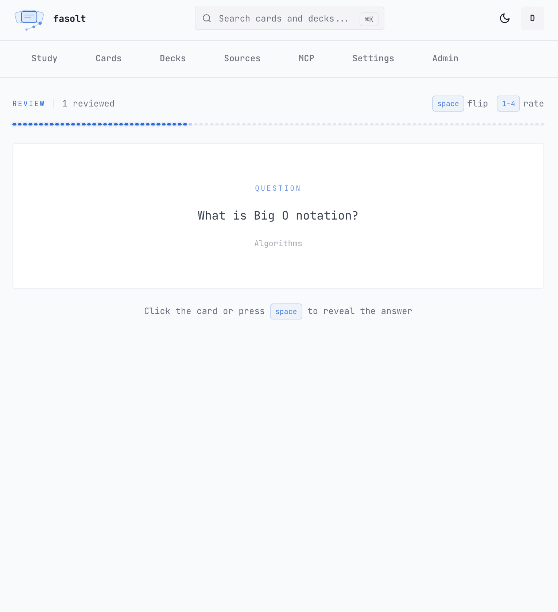
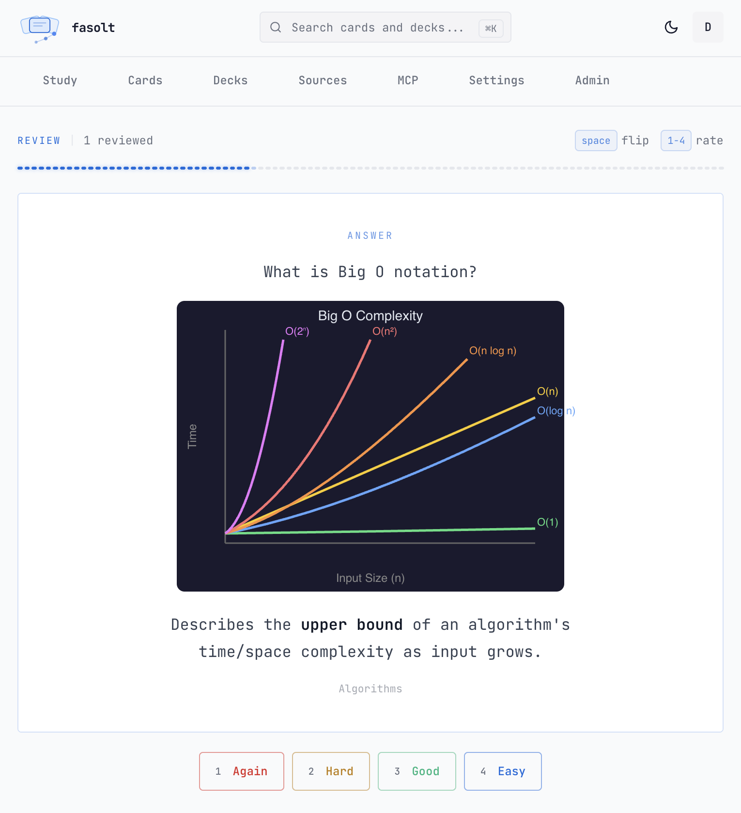
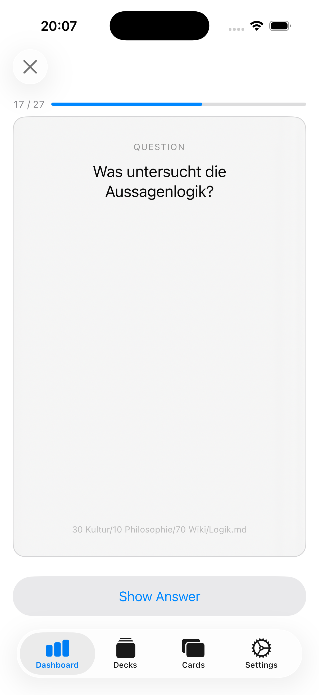
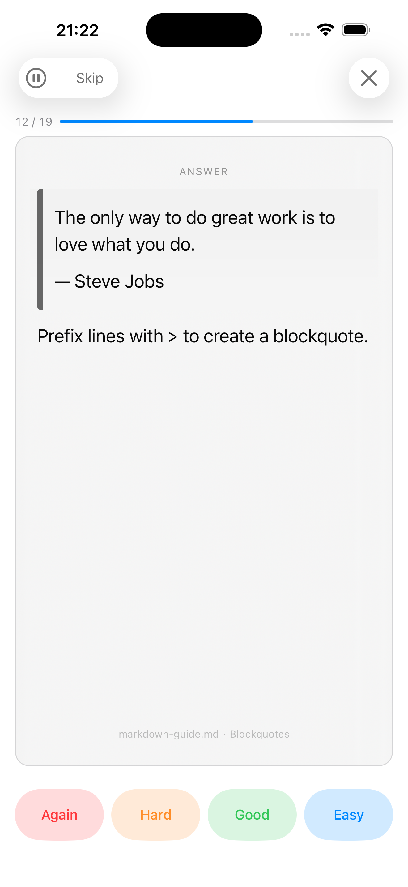
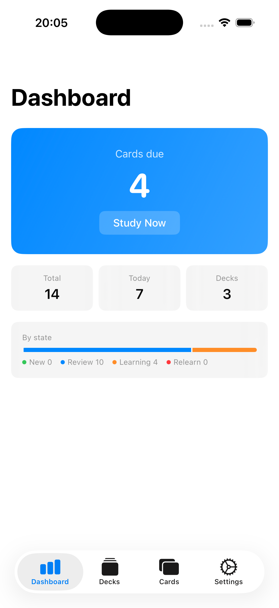
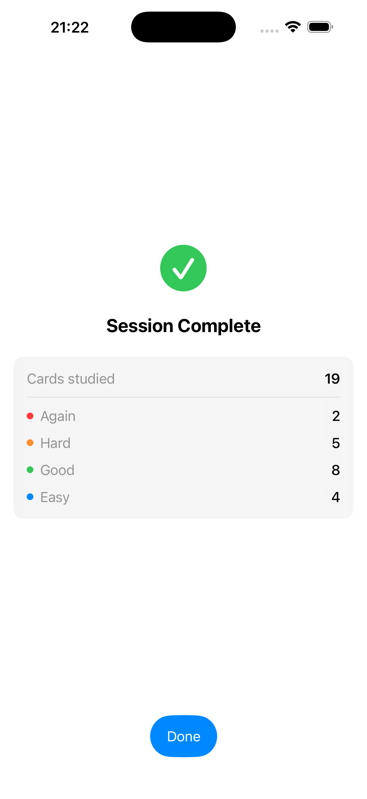

<p align="center">
  
</p>

<h1 align="center">fasolt</h1>

<p align="center">
  MCP-first spaced repetition for your markdown notes.<br/>
</p>

<i>100 % Vibecoded. I wanted todo this project for years but never had the time. Finally started to vibecode it and it quickly shifted goals to just be a frontend and let agents generate the cards.</i>

---

Connect fasolt to Claude Code, Cursor, or any MCP-compatible agent. Point it at your markdown files. Study the flashcards it creates.

<p align="center">
  
  
</p>

## How It Works

1. **Write notes**: Obsidian, any editor, plain text. No special format required.
2. **Your AI creates flashcards**: ask your agent to read a file and push cards to fasolt via MCP
3. **Study**: review due cards in the browser or iOS app, FSRS schedules reviews at increasing intervals

## Features

- FSRS spaced repetition with optimized scheduling
- MCP to connect your AI agent to
- SVG support: agents can generate diagrams, charts, and visualizations directly on cards
- Source tracking, cards retain context (file, heading) as metadata
- Decks for organizing cards into focused study sessions
- Full-text search across cards and decks
- Dashboard with due counts, totals, and study streaks
- Native iOS app with offline support
- Self-hostable via Docker

## iOS App

Native iOS app (Swift / SwiftUI) for studying on the go. Syncs with the backend, supports offline review with automatic sync when back online, and receives push notifications when cards are due.

<p align="center">
  
  
  
  
</p>

## MCP

fasolt exposes a remote [MCP](https://modelcontextprotocol.io/) server that lets AI agents create and manage flashcards on your behalf. Your agent reads your local markdown files, extracts key concepts, and pushes cards to fasolt — you never upload files to the server.

Add the MCP server URL to your agent of choice (Claude Code, Cursor, Copilot, etc.). Authentication happens via OAuth.

```
http://localhost:8080/mcp
```

The server provides tools for creating, searching, updating, and deleting cards and decks — all discoverable automatically when your agent connects.

**Example:**
```
You:   "Create flashcards from my kubernetes-notes.md"
Agent: reads local file → checks for duplicates → creates cards via MCP → done
```

## Tech Stack

| Layer | Tech |
|-------|------|
| Backend | .NET 10, ASP.NET Core Minimal API, EF Core + Npgsql |
| Frontend | Vue 3 + TypeScript + Vite, shadcn-vue, Tailwind CSS 3, Pinia |
| Database | Postgres 17 |
| Auth | ASP.NET Core Identity + OpenIddict (OAuth 2.0 for MCP) |
| MCP | Built into the backend, streamable HTTP transport at `/mcp` |

## Quick Start

Prerequisites: Docker, .NET 10 SDK, Node.js

```bash
./dev.sh                                # starts everything

# or manually:
docker compose up -d                    # Postgres on :5432
dotnet run --project fasolt.Server      # API on :8080
cd fasolt.client && npm run dev         # UI on :5173
```

A dev account is created automatically on startup:

- **Email:** `dev@fasolt.local`
- **Password:** `Dev1234!`

## Project Structure

```
fasolt.Server/
  Domain/           — entities, value objects
  Application/      — services, DTOs, use case logic
  Infrastructure/   — EF Core DbContext, migrations
  Api/              — endpoints, MCP tools, middleware
fasolt.client/      — Vue 3 SPA
fasolt.ios/         — native iOS app (SwiftUI)
fasolt.Tests/       — service-level tests (xUnit + Postgres)
```
